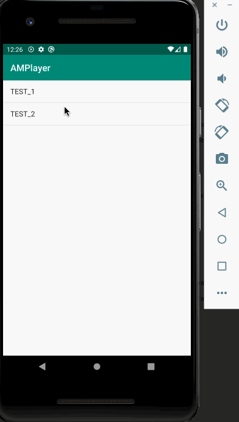

# ExoPlayerMusic

This sample shows how to implement a music player app backed by the [ExoPlayer](https://exoplayer.dev).

You can build on this project as a good starting point to release your own music player.

## Demo



## Features

- Following the official guideline for the audio media apps.
   - See https://developer.android.com/guide/topics/media-apps/media-apps-overview
- Elaborated UI like the Apple Music Player
- Extracting a lyrics from id3 metadata(USLT tag)
- Background playback
- Volume control support

## Customize

If you just want to add your sources in the code directly, look at InMemorySource.kt below.

```kotlin
class InMemorySource() : AbstractMusicSource() {
...
    private suspend fun getCatalog(): List<MediaMetadataCompat> {
        return listOf(
            Pair(
                "https://storage.googleapis.com/maison-great-dev/oss/musicplayer/tagmp3_1473200_1.mp3",
                "TEST_1"
            ),
            Pair(
                "https://storage.googleapis.com/maison-great-dev/oss/musicplayer/tagmp3_2160166.mp3",
                "TEST_2"
            )
...
```

You can switch to other implementations backed by network, database, and so on if needed.

## Music

- Smith, J.O. Physical Audio Signal Processing: https://ccrma.stanford.edu/~jos/waveguide/Sound_Examples.html
  - This project is using these as sample mp3 files.
- file-examples.com: https://file-examples.com/index.php/sample-audio-files/sample-mp3-download/
  - This project is using one as a sample mp3 file.

## License

The MIT License (MIT)

## Acknowledgement

Thank you to the following projects and creators.

- uamp: https://github.com/android/uamp
  - I referred to this official sample project for the interface and some implementation.
